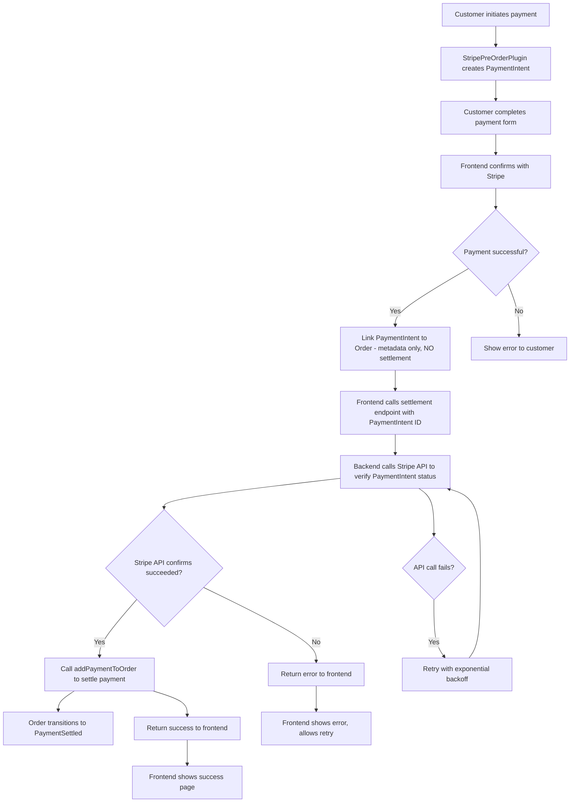

# Design Document

## Overview

Since the StripePreOrderPlugin is the only Stripe payment system used on the site, this design focuses on **fixing the payment settlement timing issue** by implementing proper webhook-based confirmation instead of immediate settlement.

### Root Cause Analysis

The fundamental issue is premature payment settlement:

1. **Current flow**: PaymentIntent created → linked to order → immediately settled → Stripe confirmation happens later
2. **Problem**: Orders show as "PaymentSettled" even when payments are cancelled or fail in Stripe
3. **Missing piece**: No webhook system to receive actual payment confirmation from Stripe
4. **Timing issue**: Settlement happens before confirmation instead of after

### The Correct Approach

The solution is to implement frontend-triggered confirmation with API verification:

1. **PaymentIntent creation and linking** - no immediate settlement
2. **Frontend confirmation** - Stripe confirms payment in browser
3. **Backend API verification** - verify PaymentIntent status directly with Stripe API
4. **Conditional settlement** - only settle after API confirms payment succeeded

## Architecture

### Current Flow Issues
The current implementation has these problems:
1. `linkPaymentIntentToOrder` immediately calls `addPaymentToOrder`, settling the payment before Stripe confirmation
2. No webhook handling for payment_intent.succeeded events
3. Frontend confirmation happens after settlement, making it ineffective
4. No idempotency protection against duplicate settlements

### Corrected Flow Design (Frontend-Triggered with API Verification)



### Why This Approach Works

1. **No webhook dependencies**: Eliminates all network routing and configuration issues
2. **Immediate feedback**: Customer gets instant confirmation after payment
3. **Direct API verification**: More reliable than webhook delivery
4. **Simple architecture**: No complex webhook endpoint setup required
5. **Controllable timing**: You control exactly when verification happens

## Components and Interfaces

### 1. Simplified StripePreOrderPlugin

The plugin should be **dramatically simplified** to only handle pre-order PaymentIntent creation and linking:

```typescript
class StripePreOrderResolver {
    // Keep existing - creates PaymentIntent before order exists
    async createPreOrderStripePaymentIntent(estimatedTotal: number, currency: string): Promise<string>
    
    // Simplified - ONLY update metadata, NO payment processing
    async linkPaymentIntentToOrder(
        paymentIntentId: string, 
        orderId: string, 
        orderCode: string, 
        finalTotal: number, 
        customerEmail: string
    ): Promise<boolean>
    
    // Remove all settlement logic - let official plugin handle it
}
```

### 2. Add Settlement Endpoint with Stripe API Verification

**Create a new settlement endpoint** that verifies payments with Stripe API:

```typescript
class StripePreOrderResolver {
    // New settlement endpoint
    async settleStripePayment(paymentIntentId: string): Promise<boolean> {
        // 1. Verify PaymentIntent status with Stripe API
        const paymentIntent = await stripe.paymentIntents.retrieve(paymentIntentId);
        
        // 2. Only settle if Stripe confirms payment succeeded
        if (paymentIntent.status === 'succeeded') {
            // 3. Call addPaymentToOrder to settle
            return await this.addPaymentToOrder(paymentIntent);
        }
        
        throw new Error(`Payment not succeeded: ${paymentIntent.status}`);
    }
}
```

### 3. Frontend-Triggered Settlement Flow

Use direct API verification instead of webhooks:

```typescript
// Frontend calls settlement after Stripe confirmation
const result = await settleStripePaymentMutation({
    paymentIntentId: 'pi_xxx...'
});
```

This approach eliminates webhook configuration issues while ensuring proper verification.

### 4. Frontend Integration Changes

#### Updated StripePayment Component
```typescript
async confirmStripePreOrderPayment(order: any): Promise<void> {
    // 1. Link PaymentIntent to order (metadata only, NO settlement)
    await linkPaymentIntentToOrderMutation(
        paymentIntentId,
        order.id,
        order.code,
        order.totalWithTax,
        order.customer?.emailAddress || 'guest'
    );
    
    // 2. Confirm with Stripe
    const { error } = await stripe.confirmPayment({
        elements: stripeElements,
        clientSecret: clientSecret,
        confirmParams: {
            return_url: `${baseUrl}/checkout/confirmation/${order.code}`,
        },
    });
    
    if (error) {
        throw new Error(error.message);
    }
    
    // 3. Call settlement endpoint with API verification
    const settlementResult = await settleStripePaymentMutation({
        paymentIntentId: paymentIntentId
    });
    
    if (!settlementResult) {
        throw new Error('Payment settlement failed');
    }
    
    // 4. Navigate to confirmation - payment is now settled
    navigate(`/checkout/confirmation/${order.code}`);
}
```

#### Key Changes
1. **Remove immediate settlement** from linkPaymentIntentToOrder
2. **Add settlement endpoint call** after Stripe confirmation
3. **Backend verifies with Stripe API** before settling
4. **No webhook dependencies** - direct API verification only

## Data Models

### PaymentIntent Metadata
```typescript
interface PaymentIntentMetadata {
    vendure_order_code: string;
    vendure_order_id: string;
    vendure_customer_email: string;
    // Keep minimal metadata for order linking
}
```

### Settlement Request Interface
```typescript
interface SettlementRequest {
    paymentIntentId: string;
}

interface SettlementResponse {
    success: boolean;
    orderId?: string;
    error?: string;
}
```

### Stripe API Response Handling
```typescript
interface StripePaymentIntentStatus {
    id: string;
    status: 'succeeded' | 'failed' | 'pending' | 'canceled';
    amount: number;
    currency: string;
    metadata: Record<string, string>;
}
```

## Error Handling

### Simplified Error Scenarios

Since we're using Vendure's standard flow, error handling becomes much simpler:

#### Frontend Errors
1. **Stripe confirmation fails**: Show error, don't call `addPaymentToOrder`
2. **addPaymentToOrder fails**: Show error, allow user to retry
3. **Network issues**: Standard retry logic for GraphQL mutations

#### Backend Errors  
1. **PaymentIntent linking fails**: Return error to frontend
2. **Stripe API verification fails**: Retry with exponential backoff
3. **Settlement processing fails**: Return detailed error for frontend handling
4. **Order state conflicts**: Handle gracefully with proper error messages

#### API Verification Errors
1. **Network failures**: Implement retry logic with exponential backoff
2. **Invalid PaymentIntent**: Return clear error message to frontend
3. **Payment not succeeded**: Inform frontend of actual payment status
4. **Duplicate settlements**: Handle idempotently, return success if already settled

### Benefits of API Verification Flow
1. **No webhook configuration**: Eliminates network routing and infrastructure issues
2. **Immediate feedback**: Customer gets instant confirmation after payment
3. **Direct control**: You control timing and retry logic
4. **Simpler debugging**: API calls are easier to troubleshoot than webhook delivery

### Recovery Mechanisms
Use Vendure's built-in admin tools:
- **Payment management in Admin UI**: View and manage payments through standard interface
- **Order state transitions**: Use admin API to manually transition orders if needed
- **Stripe dashboard**: Use Stripe's tools to investigate payment issues
- **Vendure logs**: Standard logging provides audit trail for troubleshooting

## Testing Strategy

### Unit Tests
1. **PaymentSettlementService**: Test idempotency, error handling, Stripe API integration
2. **Webhook handlers**: Test signature verification, event processing, error scenarios
3. **Resolver methods**: Test parameter validation, state management
4. **Frontend confirmation**: Test success/failure flows, error handling

### Integration Tests
1. **End-to-end payment flow**: Create PaymentIntent → Link to order → Webhook settlement
2. **Fallback scenarios**: Test frontend confirmation when webhooks are delayed
3. **Error recovery**: Test duplicate settlements, failed settlements, retry logic
4. **Concurrent access**: Test multiple simultaneous settlement attempts

### Test Scenarios
```typescript
describe('Payment Settlement', () => {
    test('webhook settlement succeeds')
    test('frontend fallback settlement succeeds')
    test('duplicate settlement is idempotent')
    test('invalid PaymentIntent is rejected')
    test('settlement fails gracefully with proper logging')
    test('concurrent settlements are handled safely')
})
```

## Security Considerations

### Webhook Security
1. **Signature verification**: Always verify Stripe webhook signatures
2. **Endpoint protection**: Rate limiting on webhook endpoints
3. **Payload validation**: Validate all webhook payload data
4. **Audit logging**: Log all webhook events for security monitoring

### API Security
1. **Authentication**: Ensure settlement endpoints require proper authentication
2. **Authorization**: Verify user permissions for manual settlement operations
3. **Input validation**: Sanitize and validate all input parameters
4. **Rate limiting**: Prevent abuse of settlement endpoints

## Performance Considerations

### Webhook Processing
- **Async processing**: Handle webhooks asynchronously to prevent timeouts
- **Batch processing**: Group multiple webhook events if needed
- **Database optimization**: Use proper indexes for PaymentIntent lookups
- **Caching**: Cache frequently accessed order and payment data

### Monitoring and Alerting
```typescript
interface PaymentMetrics {
    webhookProcessingTime: number;
    settlementSuccessRate: number;
    duplicateSettlementAttempts: number;
    failedSettlements: number;
    averageSettlementDelay: number;
}
```

## Why Previous Solutions Failed

### Frontend Confirmation Approach Issues
The previous solution (`confirmStripePaymentSuccess`/`confirmStripePaymentFailure`) failed because:

1. **Fighting Vendure's design**: Tried to bypass standard payment flow
2. **Duplicate settlement logic**: Competed with official StripePlugin
3. **Complex state management**: Required custom success/failure handling
4. **Race conditions**: Multiple systems trying to settle same payment

### Webhook Approach Issues
Webhook implementations failed because:

1. **Network routing problems**: 404 errors despite correct Stripe and Vendure configuration
2. **Infrastructure complexity**: Nginx, firewall, and network configuration issues
3. **Debugging difficulty**: Hard to troubleshoot webhook delivery problems
4. **External dependency**: Relies on Stripe's webhook delivery reliability

### This Solution's Advantages

| Aspect | Current (Broken) | Webhook Approach | This Solution |
|--------|------------------|------------------|---------------|
| **Settlement timing** | Immediate (wrong) | After confirmation ✓ | After confirmation ✓ |
| **Network dependencies** | None | High (webhooks) | Low (API calls) |
| **Debugging complexity** | Low | High | Medium |
| **Reliability** | Poor | Medium | High |
| **Configuration** | Simple | Complex | Simple |
| **Infrastructure** | Simple | Complex (nginx/routing) | Simple |

### Why This Approach Works

1. **Eliminates webhook complexity**: No network routing or configuration issues
2. **Direct verification**: API calls are more reliable than webhook delivery
3. **Immediate feedback**: Customer gets instant confirmation after payment
4. **Simple architecture**: Fewer moving parts to break or misconfigure
5. **Controllable timing**: You control exactly when verification and settlement happen

## Migration Strategy

### Phase 1: Preparation
1. Deploy new webhook handlers (inactive)
2. Add new settlement endpoints
3. Update frontend to use new confirmation flow
4. Add comprehensive logging

### Phase 2: Gradual Rollout
1. Enable webhook processing for new payments
2. Monitor settlement success rates
3. Test fallback mechanisms
4. Verify no duplicate settlements

### Phase 3: Full Migration
1. Remove old immediate settlement logic
2. Clean up deprecated code paths
3. Update documentation
4. Train support team on new flow

## Rollback Plan

### Quick Rollback
1. Disable webhook processing
2. Re-enable immediate settlement in linkPaymentIntentToOrder
3. Revert frontend changes
4. Monitor for any stuck payments

### Data Consistency
1. Identify any payments settled by both old and new systems
2. Reconcile duplicate payment records
3. Refund any double-charges
4. Update order states as needed