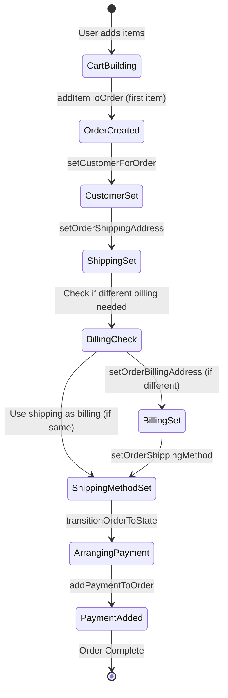

# Vendure Correct Order Sequence - Official Documentation

## Executive Summary

Based on **official Vendure documentation** and the **official Qwik starter implementation**, the correct order creation and checkout sequence is documented below. This corrects previous misconceptions about when `setCustomerForOrder` should be called.

## Key Discovery: Two Different Approaches

### **Approach 1: Official Qwik Starter (No Local Cart)**
- Works directly with Vendure's `activeOrder` throughout
- Items are added immediately to Vendure as they're selected
- Customer and shipping info collected during checkout

### **Approach 2: Our Implementation (Local Cart)**  
- Items stored in localStorage until checkout
- Batch conversion of local cart to Vendure order during checkout
- Customer and shipping info collected during checkout

## The Correct Vendure Order Sequence

### **Phase 1: Cart Building**
```typescript
// ✅ CORRECT: addItemToOrder automatically creates active order if none exists
const result = await addItemToOrder(productVariantId, quantity);

// This single call:
// 1. Creates an active order session if none exists
// 2. Adds the item to the order
// 3. Returns the updated order
```

**Key Points:**
- `addItemToOrder` **automatically creates** an active order if none exists
- **No customer setup required** at this stage
- Order exists in "AddingItems" state
- Can continue adding/removing items

### **Phase 2: Checkout Process**

From the **official Qwik starter checkout sequence**:

```typescript
// STEP 1: Collect customer and shipping info (UI forms)
const customer: CreateCustomerInput = {
  emailAddress: 'customer@example.com',
  firstName: 'John',
  lastName: 'Doe',
  phoneNumber: '123-456-7890'
};

const shippingAddress: CreateAddressInput = {
  streetLine1: '123 Main St',
  city: 'Anytown',
  province: 'State',
  postalCode: '12345',
  countryCode: 'US'
};

// STEP 2: Set customer for order (only if not already logged in)
if (customer.id === CUSTOMER_NOT_DEFINED_ID) {
  const customerResult = await setCustomerForOrderMutation(customer);
  if (customerResult.__typename === 'Order') {
    // Customer successfully set
  }
}

// STEP 3: Set shipping address
const shippingResult = await setOrderShippingAddressMutation(shippingAddress);
if (shippingResult.__typename === 'Order') {
  // Shipping address set
}

// STEP 4: Set billing address (OUR ENHANCEMENT - Qwik starter doesn't have this)
if (useDifferentBilling) {
  const billingAddress: CreateAddressInput = {
    streetLine1: billingAddress.streetLine1,
    city: billingAddress.city,
    province: billingAddress.province,
    postalCode: billingAddress.postalCode,
    countryCode: billingAddress.countryCode
  };
  
  const billingResult = await setOrderBillingAddressMutation(billingAddress);
  if (billingResult.__typename === 'Order') {
    // Billing address set
  }
}
// Note: If not using different billing, Vendure uses shipping address as billing

// STEP 5: Set shipping method
const shippingMethodResult = await setOrderShippingMethodMutation(shippingMethodId);

// STEP 6: Transition to payment state
const transitionResult = await transitionOrderToStateMutation('ArrangingPayment');

// STEP 7: Add payment
const paymentResult = await addPaymentToOrderMutation(paymentInput);
```

## Official Vendure Documentation Sequence

From **Vendure Order Workflow Guide**:

1. **Add Items**: `addItemToOrder` (creates order automatically)
2. **Set Customer**: `setCustomerForOrder` (during checkout)
3. **Set Shipping Address**: `setOrderShippingAddress`
4. **Set Billing Address**: `setOrderBillingAddress` (optional - our enhancement)
5. **Choose Shipping Method**: `setOrderShippingMethod`
6. **Transition State**: `transitionOrderToState('ArrangingPayment')`
7. **Add Payment**: `addPaymentToOrder`

## Qwik Starter Implementation Analysis

### **Cart Phase (Product Pages)**
```typescript
// Items added directly to Vendure as selected
await addItemToOrder(productVariantId, quantity);
// Creates activeOrder automatically, no customer setup needed
```

### **Checkout Phase (Checkout Page)**
```typescript
// From checkout/index.tsx onForward$ handler:

// 1. Check if customer needs to be set
if (appState.customer.id === CUSTOMER_NOT_DEFINED_ID) {
  const setCustomerForOrder = await setCustomerForOrderMutation(customer);
  if (setCustomerForOrder.__typename === 'Order') {
    // Customer set, proceed to shipping
    setOrderShippingAddress();
  }
} else {
  // Customer already logged in, go straight to shipping
  setOrderShippingAddress();
}

// 2. Set shipping address
const setOrderShippingAddress = async () => {
  const result = await setOrderShippingAddressMutation(shippingAddress);
  if (result.__typename === 'Order') {
    // Either show payment step or confirm payment
    if (isPaymentStepEnabled) {
      state.step = 'PAYMENT';
    } else {
      confirmPayment();
    }
  }
};

// 3. Confirm payment
const confirmPayment = async () => {
  await transitionOrderToStateMutation(); // To 'ArrangingPayment'
  const activeOrder = await addPaymentToOrderMutation();
  navigate(`/checkout/confirmation/${activeOrder.code}`);
};
```

## Our Implementation Corrections

### **WRONG Approach (My Previous Fix):**
```typescript
// ❌ WRONG: Trying to set customer before items exist
const customerResult = await setCustomerForOrderMutation(customer);
// This fails because no active order exists yet

// Then trying to add items
for (const item of items) {
  await addItemToOrder(item.productVariantId, item.quantity);
}
```

### **CORRECT Approach (Based on Documentation):**
```typescript
// ✅ CORRECT: Add items first (creates active order)
for (const item of items) {
  const result = await addItemToOrder(item.productVariantId, item.quantity);
  // First call creates the active order automatically
}

// Customer setup happens later during checkout form submission
// Not during cart conversion!
```

## Our Implementation vs Qwik Starter Comparison

### **Key Differences: Billing Address Support**

| Feature | Qwik Starter | Our Implementation |
|---------|-------------|-------------------|
| **Billing Address** | ❌ Not supported | ✅ Full support with validation |
| **Billing/Shipping Toggle** | ❌ No option | ✅ "Use different billing address" checkbox |
| **Address Validation** | Basic | Enhanced with per-field validation |
| **Billing Address Form** | None | Dedicated `BillingAddressForm` component |
| **Vendure Integration** | Shipping only | Both shipping + billing mutations |

### **Our Enhanced Checkout Sequence**

```typescript
// Our complete checkout flow with billing address support
const checkoutSequence = async () => {
  // 1. Cart conversion (unchanged from Qwik starter)
  for (const item of cartItems) {
    await addItemToOrder(item.productVariantId, item.quantity);
  }
  
  // 2. Customer setup (same as Qwik starter)
  if (customer.id === CUSTOMER_NOT_DEFINED_ID) {
    await setCustomerForOrderMutation(customer);
  }
  
  // 3. Shipping address (same as Qwik starter)
  await setOrderShippingAddressMutation(shippingAddress);
  
  // 4. ENHANCEMENT: Billing address (our addition)
  if (checkoutValidation.useDifferentBilling) {
    // Validate billing address first
    if (!isBillingAddressValid(appState.billingAddress)) {
      throw new Error('Please complete all required billing address information');
    }
    
    // Set billing address in Vendure
    const billingResult = await setOrderBillingAddressMutation({
      fullName: `${appState.billingAddress.firstName} ${appState.billingAddress.lastName}`.trim(),
      streetLine1: appState.billingAddress.streetLine1,
      streetLine2: appState.billingAddress.streetLine2,
      city: appState.billingAddress.city,
      province: appState.billingAddress.province,
      postalCode: appState.billingAddress.postalCode,
      countryCode: appState.billingAddress.countryCode
    });
    
    if (billingResult.__typename !== 'Order') {
      throw new Error('Failed to set billing address');
    }
  }
  // If useDifferentBilling is false, Vendure automatically uses shipping address as billing
  
  // 5. Continue with standard flow
  await setOrderShippingMethodMutation(shippingMethodId);
  await transitionOrderToStateMutation('ArrangingPayment');
  await addPaymentToOrderMutation(payment);
};
```

### **Billing Address Validation Logic**

Our implementation includes comprehensive billing address validation:

```typescript
// From CheckoutValidationContext.tsx
interface CheckoutValidationState {
  // ... other fields
  isBillingAddressValid: boolean;
  billingAddressErrors: {
    firstName?: string;
    lastName?: string;
    streetLine1?: string;
    city?: string;
    province?: string;
    postalCode?: string;
    countryCode?: string;
  };
  useDifferentBilling: boolean;
}

// Validation in checkout flow
if (checkoutValidation.useDifferentBilling && 
   (!appState.billingAddress?.streetLine1 || 
    !appState.billingAddress?.city ||
    !appState.billingAddress?.province || 
    !appState.billingAddress?.postalCode ||
    !appState.billingAddress?.countryCode)) {
  throw new Error('Please complete all required billing address information');
}
```

### **UI Components Unique to Our Implementation**

1. **`BillingAddressForm.tsx`**: Dedicated billing address form with:
   - Country-specific validation
   - State/province dropdown integration
   - Real-time field validation
   - Automatic inheritance from shipping when checkbox is toggled

2. **Billing Address Toggle**: Checkbox to enable/disable separate billing address:
   ```typescript
   // When checkbox is OFF: billing inherits from shipping
   if (!useDifferentBilling.value) {
     appState.billingAddress = {
       firstName: appState.customer?.firstName || '',
       lastName: appState.customer?.lastName || '',
       streetLine1: appState.shippingAddress.streetLine1 || '',
       // ... inherits all shipping address fields
     };
   }
   ```

3. **Enhanced Validation**: Per-field validation with immediate feedback

### **Order State Includes Billing Address**

Our GraphQL fragments include billing address data:

```typescript
// Our Order includes billingAddress field
type Order = {
  // ... other fields
  shippingAddress?: OrderAddress;
  billingAddress?: OrderAddress;  // ← This is our enhancement
  // ... other fields
}
```

### **1. Active Order Creation**
- **`addItemToOrder` is the primary order creator**
- **No special setup needed** - just call it
- **Works even with empty cart** - creates order on first item

### **2. Customer Assignment Timing**
- **During checkout form submission**, not cart conversion
- **Only if customer not already logged in**
- **After order already exists** with items

### **3. Checkout Flow Separation**
- **Cart Conversion**: Local items → Vendure order (items only)
- **Checkout Process**: Customer info + shipping + payment

## Implementation Strategy for Our Local Cart

### **Phase 1: Cart Conversion (Simple)**
```typescript
static async convertToVendureOrder(appliedCoupon?: { code: string }): Promise<Order> {
  // Just add items - that's it!
  for (const item of localCart.items) {
    await addItemToOrder(item.productVariantId, item.quantity);
  }
  
  // Apply coupon if needed
  if (appliedCoupon) {
    await applyCouponCode(appliedCoupon.code);
  }
  
  // Return the active order
  return await getActiveOrderQuery();
}
```

### **Phase 2: Checkout Process (Complex)**
```typescript
// This happens in checkout form submission - NOT cart conversion
if (customer.id === CUSTOMER_NOT_DEFINED_ID) {
  await setCustomerForOrderMutation(customer);
}
await setOrderShippingAddressMutation(shippingAddress);

// OUR ENHANCEMENT: Handle billing address if different from shipping
if (useDifferentBilling) {
  await setOrderBillingAddressMutation(billingAddress);
}
// Note: If useDifferentBilling is false, Vendure uses shipping address as billing

await setOrderShippingMethodMutation(shippingMethodId);
await transitionOrderToStateMutation('ArrangingPayment');
await addPaymentToOrderMutation(payment);
```

## Summary: Complete Order Sequence With Billing Address

### **The Complete Flow (Including Our Billing Enhancement)**



## Conclusion

The **official Vendure approach** is much simpler than I initially implemented:

1. **`addItemToOrder` does all the heavy lifting** (creates order, adds items)
2. **Customer setup happens during checkout**, not cart conversion
3. **Our local cart just needs to batch the `addItemToOrder` calls**
4. **Billing address support is our enhancement** - not in the Qwik starter
5. **Everything else happens in the standard checkout flow**

This aligns with both the official documentation and the working Qwik starter implementation, with our added billing address functionality.