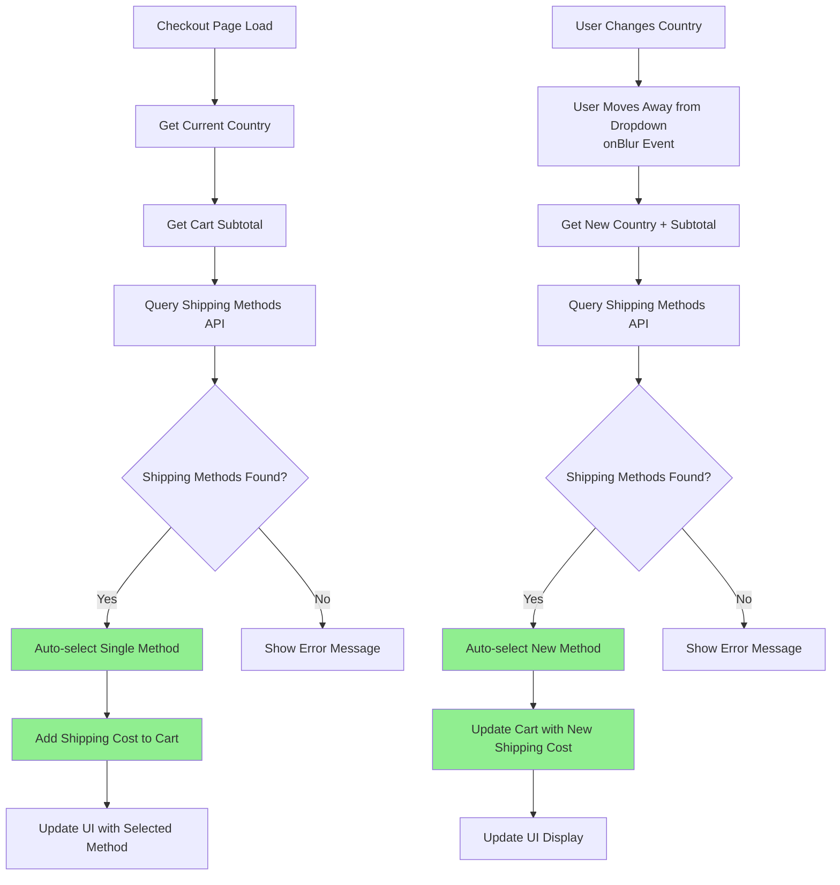

# Automatic Shipping Method Selection

## Overview

The shipping system implements automatic shipping method selection based on country + cart subtotal combination. Each combination has exactly one shipping method, eliminating the need for manual selection by users.

## Key Requirements

- **No Manual Selection**: Each country+subtotal combination has exactly 1 shipping method → auto-select it
- **Query Triggers**:
  - Initial page load (with detected/selected country)
  - When user changes country AND moves away from dropdown (onBlur event)
- **Auto-Actions**:
  - Query available shipping methods
  - Auto-select the single available option
  - Automatically add shipping cost to cart
- **No UI Clutter**: Remove manual shipping method selector since there's always only 1 option

## Visual Flow Diagram

## Implementation Details

### 1. Country Detection
- **Primary**: IP-based geolocation using multiple API services
- **Fallback**: Default to US (90% customer base)
- **Manual Override**: User can still change country via dropdown

### 2. Shipping Method Query
- Triggered on page load and country change (onBlur)
- Uses Vendure GraphQL API to fetch eligible shipping methods
- Based on current cart state and selected country

### 3. Automatic Selection
- System auto-selects the single available shipping method
- Updates cart with shipping cost automatically
- No user interaction required for shipping method selection

### 4. Error Handling
- Display clear error messages if no shipping methods available
- Graceful fallback to manual selection if needed
- Prevent infinite loops and "drainUpTo" errors

## Technical Components

### Files Modified
- `/src/components/shipping/Shipping.tsx` - Main shipping logic with geolocation
- `/src/services/geolocation.ts` - IP-based country detection service
- `/src/components/address-form/AddressForm.tsx` - Country dropdown with onBlur handler
- `/src/components/shipping-method-selector/ShippingMethodSelector.tsx` - Auto-selection logic

### Key Features
- **Geolocation Service**: Multi-provider IP detection with fallbacks
- **Session Caching**: Avoid repeated geolocation calls
- **Debounced Updates**: Prevent excessive API calls
- **Privacy-Friendly**: No GPS permissions required

## API Endpoints Used

### Geolocation APIs
1. `ipapi.co/json` - Primary geolocation service
2. `country.is` - Secondary fallback
3. `geojs.io/v1/ip/country.json` - Tertiary fallback

### Vendure APIs
- `eligibleShippingMethods` - Get available shipping methods for cart
- `setOrderShippingMethod` - Auto-select shipping method
- `activeOrder` - Get current cart state and totals

## Benefits

1. **Improved UX**: No manual shipping method selection required
2. **Reduced Friction**: Automatic country detection and method selection
3. **Error Prevention**: Eliminates infinite loop issues from manual selectors
4. **Performance**: Cached geolocation and optimized API calls
5. **Scalability**: Easy to add new countries and shipping rules

## Future Enhancements

- Add shipping cost preview before auto-selection
- Implement shipping method preferences for returning customers
- Add support for multiple shipping methods per country (with user choice)
- Integrate with real-time shipping rate APIs for dynamic pricing
