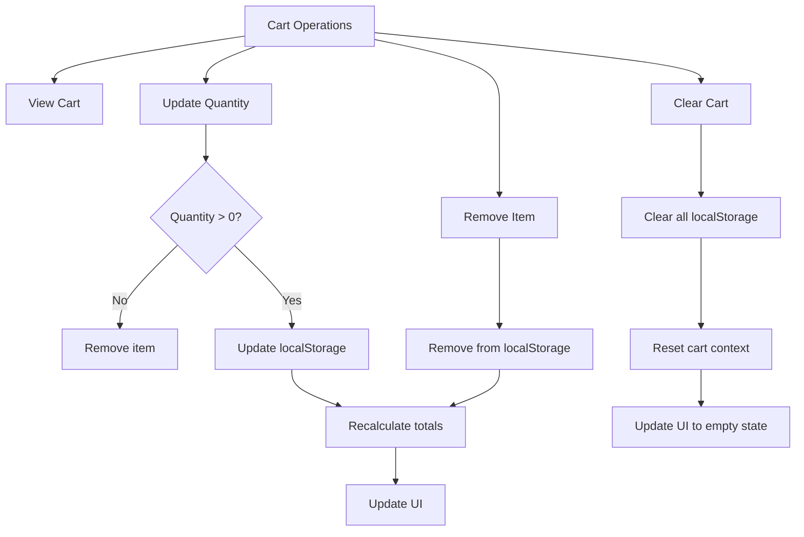
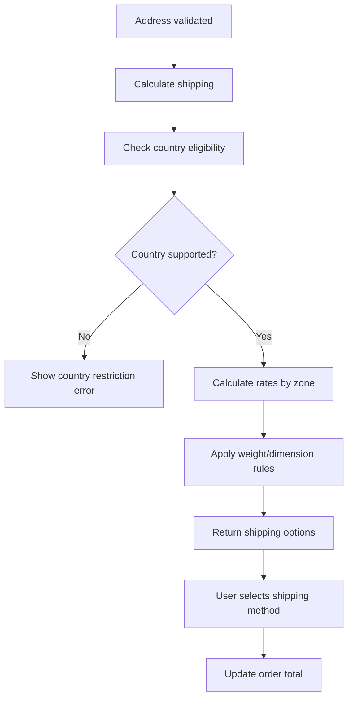
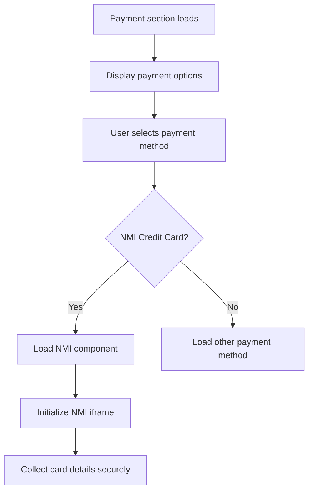
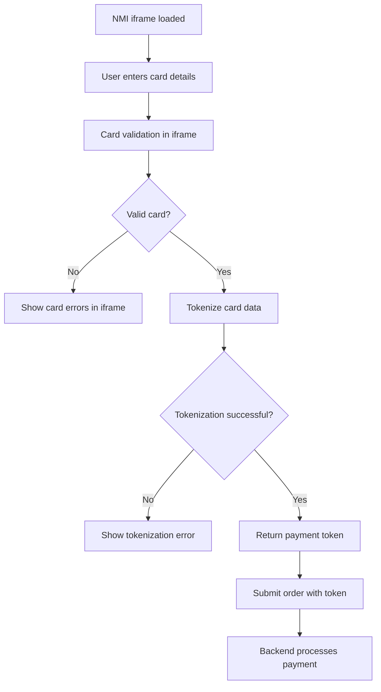
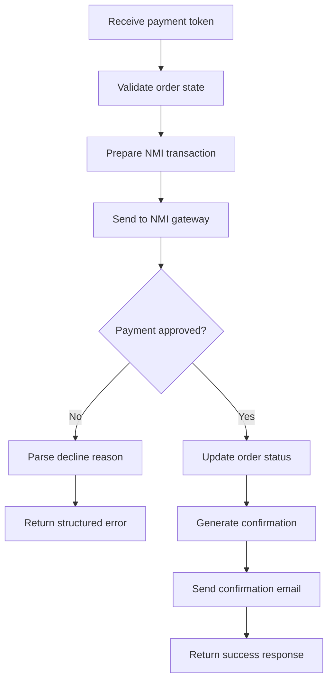
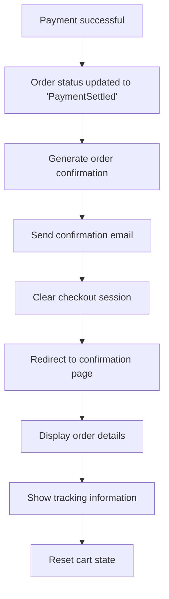
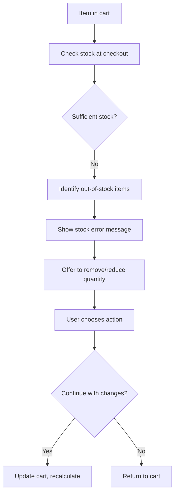
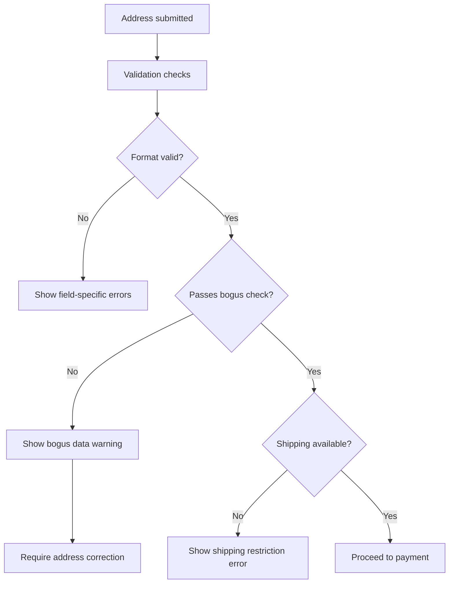
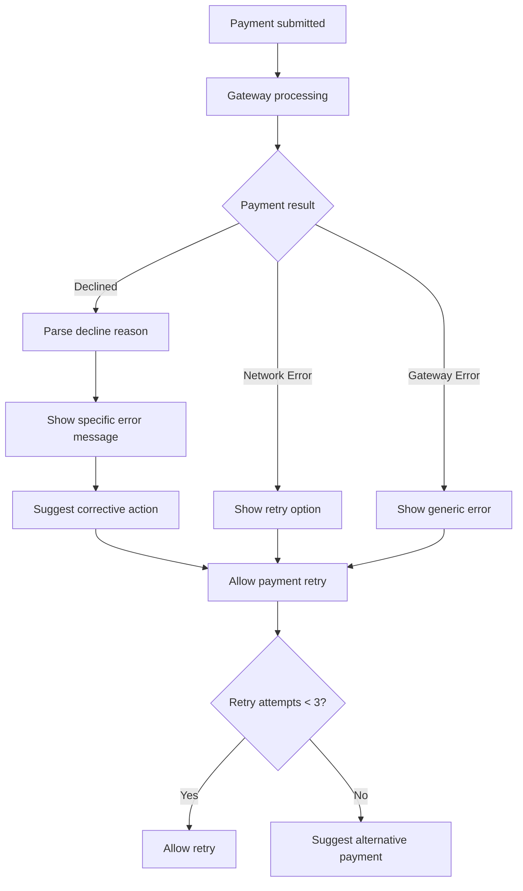
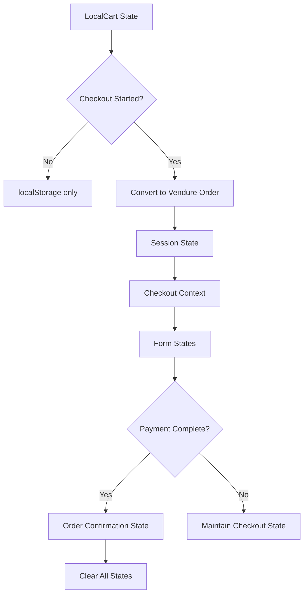

# Add-to-Cart to Order Confirmation Flowchart

## Overview
This document provides a comprehensive flowchart mapping the entire e-commerce flow from adding items to cart through order confirmation. It captures user actions, system responses, state changes, and backend communications for both positive and negative scenarios.

## System Architecture Context
- **Local Cart System**: Uses `LocalCartService` for localStorage-based cart management
- **Dual-Mode Cart**: Local cart until checkout, then converts to Vendure order
- **State Management**: Qwik signals and reactive context providers
- **Payment Processing**: NMI gateway with tokenization
- **Validation System**: Comprehensive validation with bogus data prevention

---

## 1. ADD TO CART FLOW

### 1.1 User Action: Click "Add to Cart"
**Location**: `/src/routes/products/[...slug]/index.tsx`

```mermaid
graph TD
    A[User clicks "Add to Cart"] --> B{Product variant selected?}
    B -->|No| C[Show variant selection error]
    B -->|Yes| D[Validate product availability]
    
    D --> E{Stock available?}
    E -->|No| F[Show "Out of Stock" message]
    E -->|Yes| G[Call addToCart function]
    
    G --> H[LocalCartService.addItem()]
    H --> I{Item already in cart?}
    
    I -->|Yes| J[Update quantity in localStorage]
    I -->|No| K[Add new item to localStorage]
    
    J --> L[Update cart context signal]
    K --> L
    
    L --> M[Trigger cart UI update]
    M --> N[Show success notification]
    N --> O[Update cart badge count]
```

### 1.2 Under the Hood - Add to Cart

**Files Involved:**
- `LocalCartService.ts` - Cart persistence
- `CartContext.tsx` - State management
- `Cart.tsx` - UI updates

**State Changes:**
```typescript
// localStorage update
localStorage.setItem('localCart', JSON.stringify(updatedCart))

// Context signal update
cartSignal.value = { ...cartSignal.value, items: updatedItems }

// UI state updates
- Cart badge count increments
- Success toast appears
- Cart dropdown shows new item
```

**Error Scenarios:**
- **No variant selected**: Show error, prevent add
- **Out of stock**: Disable button, show message
- **Network error**: Show retry option
- **Invalid product data**: Log error, show generic message

---

## 2. CART MANAGEMENT FLOW

### 2.1 Cart Operations


### 2.2 Cart State Management
**Location**: `CartContext.tsx`

**Reactive Updates:**
```typescript
// Quantity change triggers
useTask$(({ track }) => {
  track(() => cartSignal.value);
  // Recalculate totals
  // Update shipping estimates
  // Validate cart contents
});
```

---

## 3. CHECKOUT INITIATION FLOW

### 3.1 User Action: Proceed to Checkout
**Location**: `/src/routes/checkout/index.tsx`

```mermaid
graph TD
    A[User clicks "Checkout"] --> B{Cart empty?}
    B -->|Yes| C[Redirect to cart/products]
    B -->|No| D[Initialize checkout process]
    
    D --> E[Create Vendure order from local cart]
    E --> F[POST /api/shop/orders]
    
    F --> G{Order creation successful?}
    G -->|No| H[Show error, stay on cart]
    G -->|Yes| I[Store order ID in session]
    
    I --> J[Clear local cart]
    J --> K[Initialize checkout state]
    K --> L[Render checkout form]
```

### 3.2 Under the Hood - Checkout Initialization

**Backend Communication:**
```typescript
// API Call to create order
const response = await fetch('/api/shop/orders', {
  method: 'POST',
  body: JSON.stringify({
    lines: localCart.items.map(item => ({
      productVariantId: item.variantId,
      quantity: item.quantity
    }))
  })
});
```

**State Transitions:**
- Local cart → Vendure order
- localStorage cleared
- Session storage updated with order ID
- Checkout context initialized

---

## 4. ADDRESS & SHIPPING FLOW

### 4.1 Address Collection
**Location**: `CheckoutAddresses.tsx`

```mermaid
graph TD
    A[Address Form Rendered] --> B[User inputs address]
    B --> C[Real-time validation]
    
    C --> D{Valid format?}
    D -->|No| E[Show field errors]
    D -->|Yes| F[Bogus data check]
    
    F --> G{Passes bogus check?}
    G -->|No| H[Show validation error]
    G -->|Yes| I[Update address state]
    
    I --> J[Trigger shipping calculation]
    J --> K[API call to get shipping methods]
    
    K --> L{Shipping methods available?}
    L -->|No| M[Show "No shipping available"]
    L -->|Yes| N[Display shipping options]
```

### 4.2 Address Validation System
**Location**: `validation.ts`

**Validation Pipeline:**
```typescript
// Field validation
validateRequired(field) → validateFormat(field) → validateBogusData(field)

// Bogus data patterns
const bogusPatterns = [
  /test|fake|dummy|sample/i,
  /123.*main.*st/i,
  /asdf|qwerty/i
];
```

### 4.3 Shipping Calculation
**Backend**: Custom shipping plugin



---

## 5. PAYMENT FLOW

### 5.1 Payment Method Selection
**Location**: `Payment.tsx`



### 5.2 NMI Payment Processing
**Location**: `NMI.tsx`



### 5.3 Backend Payment Processing
**Location**: `nmi-payment-handler.ts`



**Payment Error Handling:**
```typescript
// Structured error responses
{
  success: false,
  error: {
    type: 'CARD_DECLINED' | 'INSUFFICIENT_FUNDS' | 'NETWORK_ERROR',
    message: 'User-friendly message',
    code: 'GATEWAY_ERROR_CODE'
  }
}
```

---

## 6. ORDER CONFIRMATION FLOW

### 6.1 Successful Order Completion



### 6.2 Order Confirmation Data Flow

**State Updates:**
```typescript
// Clear all checkout-related state
checkoutSignal.value = initialCheckoutState;
cartSignal.value = { items: [], total: 0 };
sessionStorage.removeItem('orderId');
localStorage.removeItem('checkoutProgress');
```

**Confirmation Page Data:**
- Order number and date
- Purchased items with quantities
- Shipping address and method
- Billing information
- Payment method (masked)
- Total amounts and taxes
- Estimated delivery date

---

## 7. ERROR SCENARIOS AND NEGATIVE FLOWS

### 7.1 Stock Validation Errors



### 7.2 Address Validation Failures



### 7.3 Payment Failures



### 7.4 System Error Recovery

**Error Boundaries:**
- Component-level error catching
- Graceful degradation
- State recovery mechanisms
- User-friendly error messages

**Recovery Strategies:**
```typescript
// Auto-recovery for transient errors
if (error.type === 'NETWORK_ERROR') {
  setTimeout(() => retryOperation(), 2000);
}

// State restoration
if (checkoutState.corrupted) {
  restoreFromBackup();
}
```

---

## 8. STATE MANAGEMENT SUMMARY

### 8.1 State Flow Diagram



### 8.2 Data Persistence Layers

| State Type | Storage Location | Persistence | Scope |
|------------|------------------|-------------|-------|
| Cart Items | localStorage | Browser session | Global |
| Order ID | sessionStorage | Tab session | Checkout |
| Form Data | React state | Component lifecycle | Form |
| User Preferences | localStorage | Persistent | Global |
| Payment Tokens | Memory only | Request lifecycle | Secure |

---

## 9. API COMMUNICATION PATTERNS

### 9.1 GraphQL Queries and Mutations

**Cart Management:**
```graphql
# Add item to order
mutation AddItemToOrder($productVariantId: ID!, $quantity: Int!) {
  addItemToOrder(productVariantId: $productVariantId, quantity: $quantity) {
    ... on Order { id, total, lines { ... } }
    ... on ErrorResult { errorCode, message }
  }
}
```

**Address and Shipping:**
```graphql
# Set shipping address
mutation SetOrderShippingAddress($input: CreateAddressInput!) {
  setOrderShippingAddress(input: $input) {
    ... on Order { shippingAddress { ... } }
  }
}

# Get shipping methods
query GetShippingMethods {
  eligibleShippingMethods {
    id, name, price, description
  }
}
```

**Payment:**
```graphql
# Add payment to order
mutation AddPaymentToOrder($input: PaymentInput!) {
  addPaymentToOrder(input: $input) {
    ... on Order { state, payments { ... } }
    ... on ErrorResult { errorCode, message }
  }
}
```

### 9.2 Error Response Handling

```typescript
// Standardized error handling
interface ApiError {
  errorCode: string;
  message: string;
  data?: any;
}

// Error mapping to user messages
const errorMessages = {
  'INSUFFICIENT_STOCK': 'Sorry, we don\'t have enough of this item in stock.',
  'COUPON_CODE_INVALID': 'The coupon code you entered is not valid.',
  'PAYMENT_DECLINED': 'Your payment was declined. Please try a different payment method.'
};
```

---

## 10. MONITORING AND LOGGING

### 10.1 Key Metrics Tracked

**User Actions:**
- Add to cart events
- Cart abandonment points
- Checkout step completion rates
- Payment attempt outcomes

**System Performance:**
- API response times
- Error rates by endpoint
- Payment gateway response times
- Address validation success rates

**Business Metrics:**
- Conversion rates by step
- Average order values
- Most common failure points
- Customer journey completion rates

### 10.2 Error Logging Strategy

```typescript
// PCI-compliant logging (no sensitive data)
logger.info('Payment attempted', {
  orderId: order.id,
  paymentMethod: 'credit_card',
  amount: order.total,
  // Never log: card numbers, CVV, full names
});

// Validation failures
logger.warn('Address validation failed', {
  field: 'zipCode',
  reason: 'invalid_format',
  // Never log: actual address data
});
```

---

## 11. CONCLUSION

This flowchart provides a comprehensive overview of the entire e-commerce flow from add-to-cart through order confirmation. Key architectural decisions include:

1. **Dual-mode cart system** for performance and reliability
2. **Comprehensive validation** to prevent fraud and errors
3. **Secure payment processing** with tokenization
4. **Graceful error handling** with user-friendly messages
5. **Reactive state management** for smooth user experience

The system is designed to handle both positive flows efficiently and negative scenarios gracefully, ensuring a robust e-commerce experience.

---

## Files Referenced

### Frontend Components
- `/src/routes/products/[...slug]/index.tsx` - Product pages and add-to-cart
- `/src/services/LocalCartService.ts` - Local cart management
- `/src/contexts/CartContext.tsx` - Cart state management
- `/src/components/cart/Cart.tsx` - Cart UI
- `/src/routes/checkout/index.tsx` - Checkout orchestration
- `/src/components/checkout/CheckoutAddresses.tsx` - Address handling
- `/src/components/payment/Payment.tsx` - Payment coordination
- `/src/components/payment/NMI.tsx` - NMI payment processing
- `/src/utils/validation.ts` - Validation utilities

### Backend Services
- `/backend/src/plugins/nmi-payment/nmi-payment-handler.ts` - Payment processing
- Custom shipping plugin - Shipping calculations
- GraphQL resolvers - API endpoints
- Order management services - Order lifecycle

This document serves as the single source of truth for understanding the complete add-to-cart to order confirmation flow in the Rotten Hand e-commerce system.
