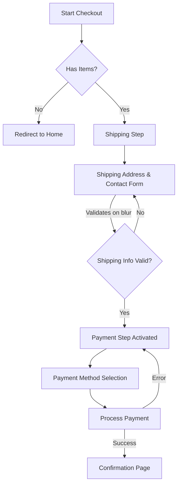

# Checkout Flow Documentation

**Last Updated: 2025-06-01** (Reflects accordion flow and removal of Stripe/Braintree)

## Overview
This document outlines the checkout process in the Rotten Hand e-commerce application. The checkout is implemented as a multi-step process using Qwik City's file-based routing and reactive components.

## File Structure
```
src/
├── routes/
│   └── checkout/
│       ├── index.tsx           # Main checkout page
│       └── confirmation/
│           └── [code]/
│               └── index.tsx  # Order confirmation page
└── components/
    ├── cart-contents/       # Cart items display
    ├── cart-totals/         # Order summary
    ├── payment/             # Payment processing
    ├── shipping/            # Address collection
    └── shipping-method-selector/
```

## Visual Flow


*Note: The "Proceed to Payment" button has been removed. The Payment Step (G) now activates automatically after shipping information (E) is successfully validated.*

## Detailed Flow

### 1. Checkout Initialization (`/checkout/index.tsx`)
- Validates cart has items
- Initializes checkout state
- Shows progress stepper with 3 steps:
  1. Shipping Checkout
  2. Payment
  3. Confirmation

### 2. Shipping Step (`Shipping.tsx`)
- **Components**:
  - `AddressForm`: Enhanced form with real-time validation
  - `AutoShippingSelector`: Automatically selects shipping methods
- **Contact Information Section**:
  - Email address validation (required)
  - First and last name validation (required)
  - Placeholder-only labels with asterisk indicators
- **Enhanced Validation**:
  - Real-time validation on field blur
  - Visual error feedback with red borders
  - Country-specific postal code validation
  - Phone number auto-formatting
  - Dynamic phone requirements (US/PR optional, others required)
  - Validation error summary panel
  - Removed redundant fullName field (auto-constructed)
  - Removed company field (<1% usage)
- **State Management**:
  - Updates `APP_STATE` with shipping info
  - Reactive form validation state
  - Auto-geolocation country detection
- **Accordion Flow**:
  - Upon successful validation of all shipping and contact information (typically on blur of the last required field), the `onForward$` callback is triggered.
  - This signals the parent checkout component to activate the Payment section, creating an accordion-style transition. The "Proceed to Payment" button has been removed.

### 3. Payment Step (`Payment.tsx`)
- **Activation**: This step becomes active and interactive once the shipping information is successfully validated and the `Shipping` component triggers its `onForward$` callback.
- **Components**:
  - `NMI`: Handles NMI payment processing
  // Fallback to standard payment method (if applicable) - (This line can be removed if NMI is the only one left or updated if other non-Stripe/Braintree methods exist)
- **Flow**:
  1. Fetches available payment methods
  2. Renders payment options
  3. Handles payment processing
  4. On success, transitions to confirmation

### 4. Confirmation (`/checkout/confirmation/[code]/index.tsx`)
- Displays order summary
- Shows success message
- Provides order details and next steps

## Key Functions

### Checkout Page
```typescript
// Main checkout flow control
const state = useStore<{ step: Step, isShippingComplete: boolean }>({ step: 'SHIPPING', isShippingComplete: false });

// Callback from Shipping component, now also handles activating payment section
const handleShippingComplete = $(async (customer: CreateCustomerInput, shippingAddress: CreateAddressInput) => {
  // ... (logic to set customer, shipping address for the order) ...
  state.isShippingComplete = true;
  if (isEnvVariableEnabled('VITE_SHOW_PAYMENT_STEP')) {
    state.step = 'PAYMENT';
  } else {
    // If payment step is configured to be skipped
    await confirmPayment(); 
  }
  window && window.scrollTo(0, 0);
});

// Handle payment confirmation
const confirmPayment = $(async () => {
  await transitionOrderToStateMutation();
  const activeOrder = await addPaymentToOrder();
  navigate(`/checkout/confirmation/${activeOrder.code}`);
});
```

### Shipping Component
```typescript
// Handle shipping form validation and progression
// onForward$ is now QRL<(customer: CreateCustomerInput, shippingAddress: CreateAddressInput) => void>
// This QRL is invoked automatically when the form is valid and the last relevant input field loses focus.
// It passes the customer and shipping data to the parent checkout component.
// The "Proceed to payment" button has been removed.
const handleInputBlur = $(async (fieldName: string) => {
  // ... validate field ...
  // ... check if form is fully valid ...
  if (formIsValid && isLastRequiredField(fieldName)) {
    // Construct customer and shippingAddress objects
    onForward$(customerData, shippingAddressData);
  }
});
```

### Payment Component
```typescript
// Handle payment method selection
const handlePayment = $(async (method: PaymentMethod) => {
  // Process payment with selected method
  // On success, call onForward$()
});
```

## State Management
- Uses Qwik's built-in state management
- `APP_STATE` context for global state
- URL parameters for order tracking
- GraphQL mutations for server state

## Error Handling
- Form validation errors shown inline
- Payment errors trigger retry flow
- Empty cart redirects to home page
- Order validation before payment

## Dependencies
- GraphQL: For API communication
- Qwik City: For routing and server functions
<!-- - @stripe/stripe-js: For Stripe payments -->
<!-- - braintree-web: For Braintree payments -->
