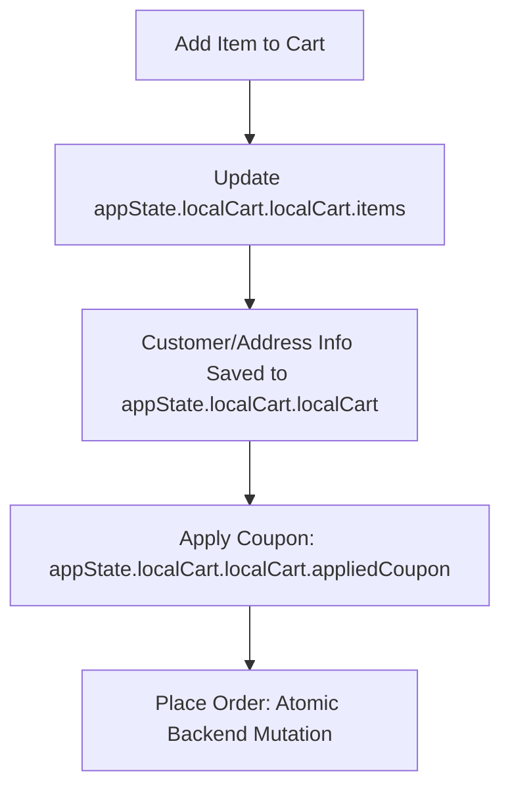

# 🛒 Local Cart & Checkout State Architecture

## Overview
This architecture unifies all cart, customer, address, coupon, and payment data in a single, type-safe state object from the moment an item is added to the cart until the order is placed. It supports both local (client-side) and backend (Vendure) cart modes, enabling atomic, robust, and maintainable checkout flows.

---

## 1. State Structure

### LocalCartState (Wrapper)
```typescript
export interface LocalCartState {
  isLocalMode: boolean;    // True for local (client-side) mode, false for backend/Vendure mode
  localCart: LocalCart;    // The actual cart data object
}
```

### LocalCart (Cart Data)
```typescript
export interface LocalCart {
  items: LocalCartItem[];
  totalQuantity: number;
  subTotal: number;
  currencyCode: string;
  appliedCoupon?: {
    couponCode: string;
    discountAmount: number;
    discountType: 'FIXED' | 'PERCENTAGE';
    freeShipping: boolean;
  };
  customer?: Customer;            // All customer info for checkout
  shippingAddress?: Address;      // Shipping address info
  billingAddress?: Address;       // Billing address info
}
```

---

## 2. Data Flow & Principles

- **Single Source of Truth:** All checkout data (items, customer, addresses, coupons, etc.) is stored in `appState.localCart.localCart`.
- **Mode Switching:** The `isLocalMode` flag determines whether the frontend operates in local (client-side) or backend (Vendure) mode.
- **No Premature Mutations:** No backend mutations for customer, address, coupon, or payment info occur until final order placement.
- **Atomic Order Placement:** At checkout, all local data is sent in a single, atomic request to the backend.
- **Serialization-Friendly:** The entire local cart state can be easily persisted (e.g., to localStorage) and restored.
- **Type Safety:** All cart and checkout logic is type-checked end-to-end for reliability and maintainability.

---

## 3. Benefits

- **Consistency:** All cart and checkout data flows through a single, unified state object.
- **Maintainability:** Easy to reason about and extend.
- **Atomicity:** No risk of partial or inconsistent state during checkout.
- **Best Practices:** Mirrors industry standards for modern e-commerce platforms.

---

## 4. Example Usage

```typescript
// Check if in local cart mode
if (appState.localCart.isLocalMode) {
  // Access or update customer/address/cart info
  appState.localCart.localCart.customer = { ... };
  appState.localCart.localCart.shippingAddress = { ... };
  appState.localCart.localCart.items.push(newItem);
}
```

---

## 5. Extensibility

- Additional fields (e.g., payment info, gift notes) can be added to `LocalCart` as needed.
- The architecture supports both local-first and backend-first flows with minimal changes to business logic.

---

## 6. Diagram



---

## 7. Summary

This architecture provides a robust, scalable foundation for a world-class checkout experience, ensuring all cart and checkout state is unified, type-safe, and ready for future growth.
