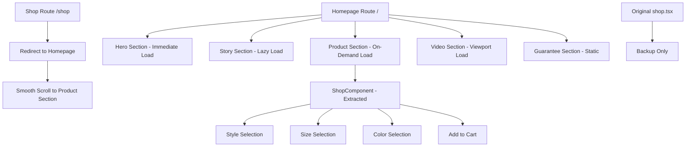

# Design Document

## Overview

This design implements a single, high-performance landing page that combines brand storytelling with product selection functionality. The architecture prioritizes performance through progressive loading, component reusability, and strategic data fetching while maintaining 100% functional parity with the existing shop page.

The design follows a component extraction pattern where the shop functionality is abstracted into a reusable component that can be integrated into the homepage, ensuring zero functionality loss and maximum maintainability.

## Architecture

### High-Level Architecture



### Component Hierarchy

```
HomePage
├── HeroSection (immediate load)
├── StorySection (lazy load after hero)
├── ShopComponent (on-demand load)
│   ├── StyleSelection
│   ├── SizeColorSelection
│   └── AddToCartFlow
├── VideoSection (viewport load)
└── GuaranteeSection (static)
```

### Loading Strategy

1. **Critical Path**: Hero section loads immediately with LCP < 1s
2. **Progressive Enhancement**: Story section loads after hero completion
3. **User Intent**: Product data loads on SHOP button click or scroll proximity
4. **Viewport Triggered**: Video section loads when visible
5. **Static Content**: Guarantee section requires no additional loading

## Components and Interfaces

### ShopComponent Interface

```typescript
interface ShopComponentProps {
  // Context for different usage scenarios
  context: 'homepage' | 'standalone';
  
  // Optional scroll target for homepage integration
  scrollTarget?: string;
  
  // Performance optimization flags
  preloadData?: boolean;
  lazyLoadAssets?: boolean;
  
  // Analytics context
  analyticsSource?: 'hero-button' | 'scroll-proximity' | 'direct-navigation';
}

interface ShopComponentState {
  selectedStyle: 'short' | 'long' | null;
  selectedSize: ProductOption | null;
  selectedColor: ProductOption | null;
  selectedVariantId: string;
  currentStep: number;
  isLoading: boolean;
  productData: ProductData;
}
```

### Progressive Loading Interface

```typescript
interface ProgressiveLoadingManager {
  // Section loading states
  heroLoaded: Signal<boolean>;
  storyVisible: Signal<boolean>;
  productSectionReady: Signal<boolean>;
  userShowedIntent: Signal<boolean>;
  videoSectionVisible: Signal<boolean>;
  
  // Loading triggers
  triggerProductLoad(): Promise<void>;
  triggerStoryLoad(): Promise<void>;
  triggerVideoLoad(): Promise<void>;
  
  // User intent detection
  detectScrollProximity(element: HTMLElement): void;
  detectShopButtonClick(): void;
}
```

### Route Loader Strategy

```typescript
// Minimal initial data - only what's needed for immediate render
export const useHomepageLoader = routeLoader$(async () => {
  return {
    heroData: {
      title: "One Shirt. 18 Options. Zero Bullshit.",
      subtitle: "If it's not the softest shirt you've ever felt, we'll pay you back",
      ctaText: "SHOP"
    },
    basicStyles: await getShirtStylesForSelection(), // Names and prices only
    // No full product data - loaded on demand
  };
});
```

## Data Models

### Product Loading Phases

```typescript
// Phase 1: Route Loader (Immediate)
interface BasicStyleData {
  shortSleeve: {
    name: string;
    basePrice: number;
    available: boolean;
  } | null;
  longSleeve: {
    name: string;
    basePrice: number;
    available: boolean;
  } | null;
}

// Phase 2: User Intent (On-Demand)
interface FullProductData {
  shortSleeve: Product | null;
  longSleeve: Product | null;
}

// Phase 3: Style Selection (Progressive)
interface ProductVariantData {
  variants: ProductVariant[];
  assets: ProductAsset[];
  options: ProductOption[];
  stockLevels: StockLevel[];
}
```

### User Intent Detection

```typescript
interface UserIntentSignals {
  shopButtonClick: boolean;
  scrollProximity: boolean; // Within 200px of product section
  directShopNavigation: boolean; // /shop route access
  naturalScroll: boolean; // Organic scrolling behavior
}
```

## Error Handling

### Progressive Loading Fallbacks

1. **Hero Section Failure**: Display minimal text-only hero with working SHOP button
2. **Story Section Failure**: Skip to product section, maintain navigation flow
3. **Product Data Failure**: Show error state with retry button and fallback to original shop page
4. **Asset Loading Failure**: Use placeholder images, maintain functionality
5. **Video Loading Failure**: Display fallback image with same messaging

### Network Resilience

```typescript
interface LoadingStrategy {
  // Timeout configurations
  heroTimeout: 2000; // 2s for critical path
  productDataTimeout: 10000; // 10s for product loading
  assetTimeout: 8000; // 8s for images/video
  
  // Retry strategies
  maxRetries: 3;
  retryDelay: 1000; // Exponential backoff
  
  // Fallback mechanisms
  enableOfflineMode: boolean;
  cacheStrategy: 'stale-while-revalidate' | 'cache-first';
}
```

### Error Boundaries

```typescript
// Component-level error boundaries
<ErrorBoundary fallback={<ShopErrorFallback />}>
  <ShopComponent />
</ErrorBoundary>

// Section-level error boundaries
<ErrorBoundary fallback={<SectionErrorFallback />}>
  <StorySection />
</ErrorBoundary>
```

## Testing Strategy

### Component Testing

1. **ShopComponent Isolation**: Test extracted component independently
2. **Context Switching**: Verify component works in both homepage and standalone contexts
3. **Progressive Loading**: Test loading states and user intent detection
4. **Error Scenarios**: Test all fallback mechanisms and error states

### Integration Testing

1. **Homepage Flow**: Test complete user journey from hero to purchase
2. **Shop Redirect**: Test /shop route redirect and scroll behavior
3. **Cart Integration**: Verify cart functionality works identically in both contexts
4. **Performance Testing**: Validate LCP, FID, and CLS targets

### User Experience Testing

1. **Fast Path Testing**: Ready buyers clicking SHOP button
2. **Story Path Testing**: Users scrolling through brand narrative
3. **Mobile Experience**: Touch interactions and viewport handling
4. **Slow Connection**: Progressive loading behavior on limited bandwidth

## Performance Optimizations

### Critical Rendering Path

```typescript
// Inline critical CSS for hero section
const CRITICAL_CSS = `
  .hero-section { /* Critical hero styles */ }
  .hero-image { /* Image optimization */ }
  .hero-overlay { /* Gradient overlay */ }
`;

// Preload critical resources
const CRITICAL_PRELOADS = [
  { rel: 'preload', as: 'image', href: heroImage768, type: 'image/avif' },
  { rel: 'preload', as: 'image', href: heroImage1600, type: 'image/avif' },
];
```

### Bundle Optimization

1. **Code Splitting**: Separate bundles for each section
2. **Dynamic Imports**: Load components only when needed
3. **Tree Shaking**: Remove unused code from final bundle
4. **Asset Optimization**: AVIF → WebP → JPEG fallback chain

### Caching Strategy

```typescript
// Route-level caching
export const onGet: RequestHandler = async ({ cacheControl, url }) => {
  if (url.pathname === '/') {
    cacheControl({
      staleWhileRevalidate: 60 * 60 * 24 * 30, // 30 days stale
      maxAge: 60 * 60 * 2 // 2 hours fresh
    });
  }
};

// Component-level caching
const productDataCache = new Map<string, ProductData>();
const assetCache = new Map<string, ProductAsset[]>();
```

## Migration Strategy

### Phase 1: Component Extraction

1. Extract shop functionality into `ShopComponent`
2. Maintain original shop.tsx as backup
3. Test component in isolation
4. Verify 100% functional parity

### Phase 2: Homepage Integration

1. Integrate `ShopComponent` into homepage
2. Implement progressive loading system
3. Add smooth scroll functionality
4. Test complete user flows

### Phase 3: Route Handling

1. Implement /shop redirect to homepage
2. Add scroll-to-section functionality
3. Update internal links and navigation
4. Test all entry points

### Phase 4: Performance Optimization

1. Implement lazy loading for all sections
2. Optimize image loading and caching
3. Add performance monitoring
4. Conduct A/B testing

## Rollback Plan

### Emergency Rollback

1. **Quick Revert**: Restore original home.tsx and shop.tsx files
2. **Route Restoration**: Remove redirect, restore original /shop route
3. **Cache Clearing**: Clear any cached versions of new implementation
4. **Monitoring**: Verify all functionality returns to baseline

### Gradual Rollback

1. **Feature Flags**: Use feature flags to control new vs old experience
2. **A/B Testing**: Route percentage of traffic to original implementation
3. **User Preference**: Allow users to choose between experiences
4. **Monitoring**: Track metrics to determine rollback necessity

## Analytics and Monitoring

### Performance Metrics

```typescript
interface PerformanceMetrics {
  // Core Web Vitals
  lcp: number; // Target: < 1.0s
  fid: number; // Target: < 100ms
  cls: number; // Target: < 0.1
  
  // Custom Metrics
  heroLoadTime: number;
  productDataLoadTime: number;
  timeToInteractive: number;
  
  // User Behavior
  scrollDepth: number;
  sectionEngagement: Record<string, number>;
  conversionRate: number;
}
```

### User Journey Tracking

1. **Entry Point**: Track how users arrive (direct, /shop redirect, etc.)
2. **Engagement**: Monitor scroll depth and section interaction
3. **Intent Signals**: Track SHOP button clicks vs organic scrolling
4. **Conversion**: Measure cart additions and checkout completion
5. **Performance Impact**: Correlate performance metrics with conversion rates

## Security Considerations

### Data Protection

1. **Client-Side Caching**: Ensure no sensitive data in browser cache
2. **API Security**: Maintain existing GraphQL security patterns
3. **User Data**: Preserve existing authentication and session handling
4. **Cart Security**: Maintain existing cart encryption and validation

### Progressive Enhancement

1. **JavaScript Disabled**: Ensure basic functionality without JS
2. **Network Failures**: Graceful degradation for offline scenarios
3. **Browser Compatibility**: Support for older browsers with fallbacks
4. **Accessibility**: Maintain WCAG compliance throughout progressive loading